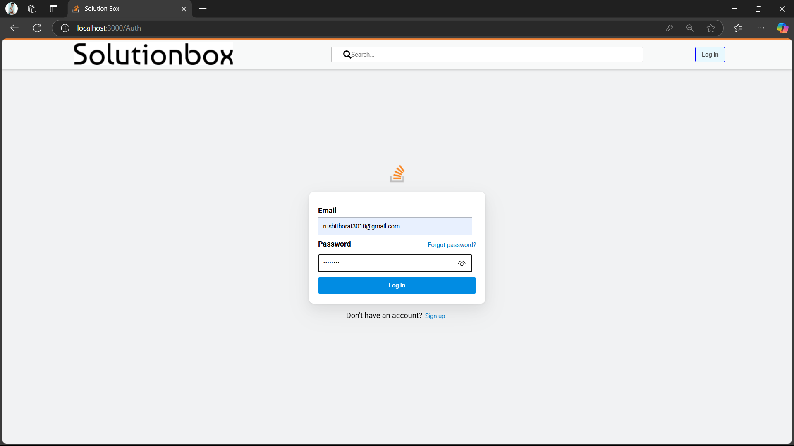
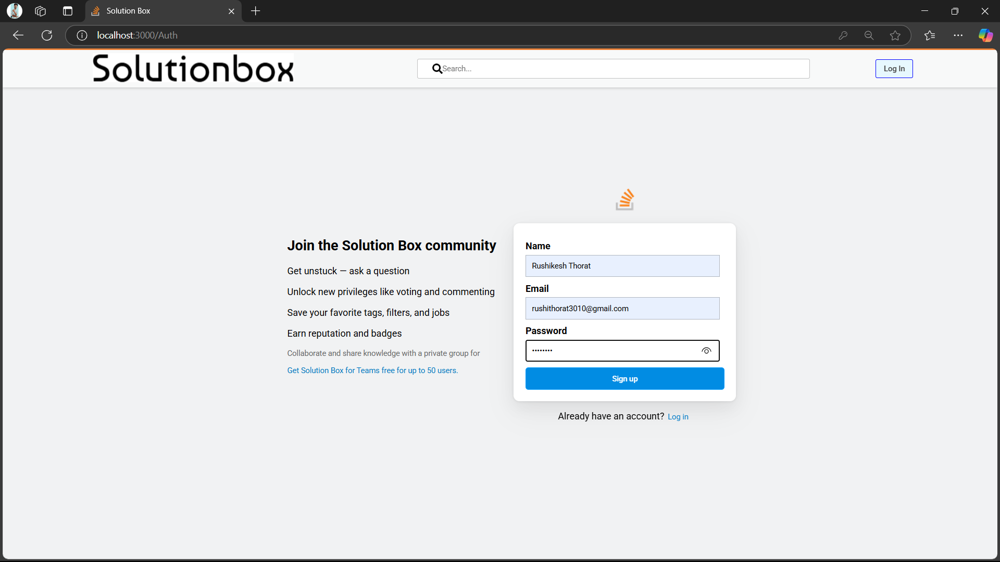
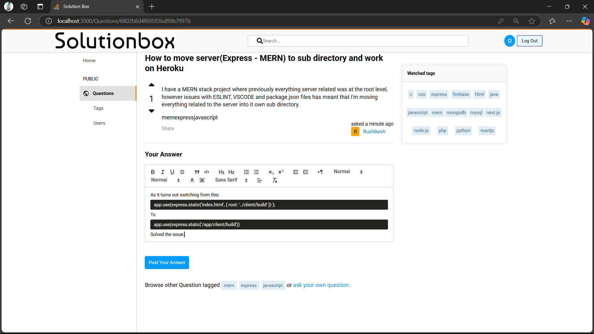
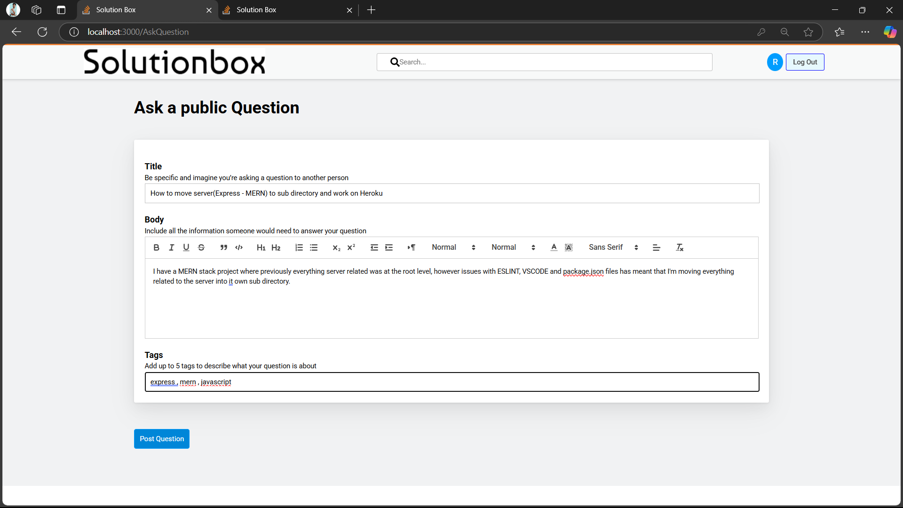
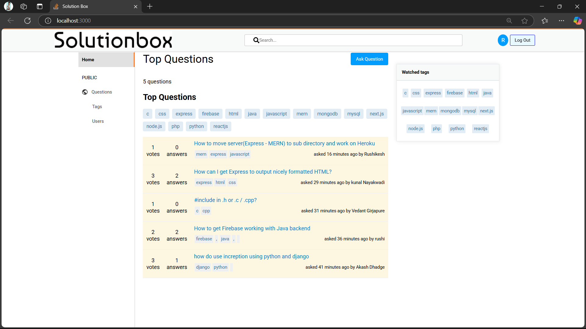
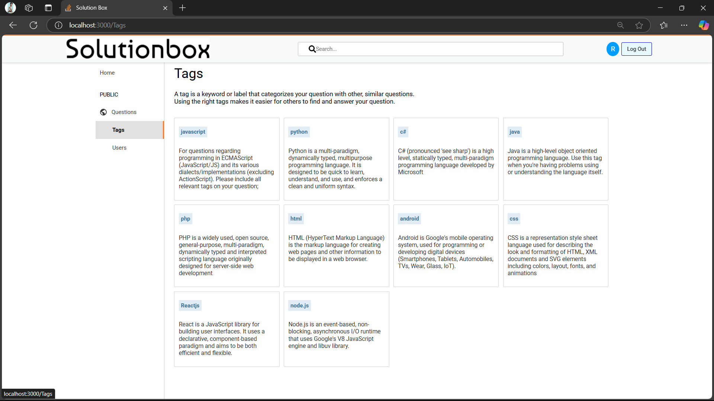
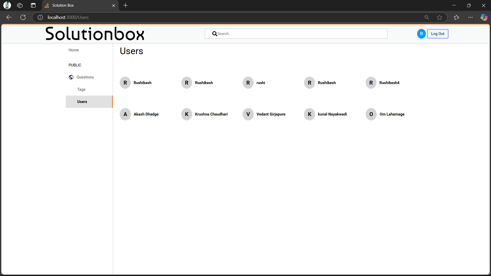
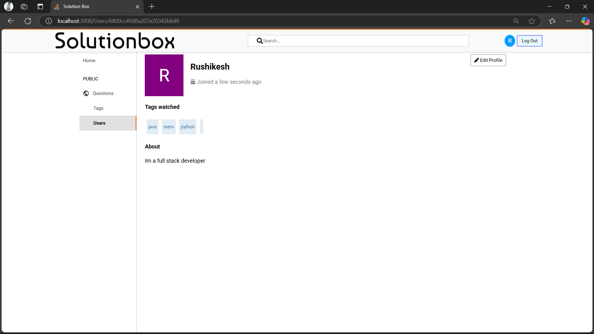

# SolutionBox - StackOverflow Clone (MERN)

This is a full-stack web application inspired by [Stack Overflow](https://stackoverflow.com/) built using the **MERN** stack:
- **MongoDB** for the database
- **Express.js** and **Node.js** for the backend API
- **React.js** for the frontend

---

## 🚀 Features

- User authentication and registration
- Ask and answer questions
- Upvote, downvote, and comment on answers
- Tag-based question categorization
- User profile and reputation system

---

## 📁 Project Structure

```
root/
│
├── client/              # React frontend
│
├── server/              # Express backend with mongoDB
│
└── README.md
```

---

## 🛠️ Setup Instructions

### 1. Clone the Repository

```bash
git clone https://github.com/Rushikesh-Thorat/stachoverflow-clone-mern.git

cd stachoverflow-clone-mern
```

### 2. Install Dependencies

#### Server (Backend)

```bash
cd server
npm install
npm install jsonwebtoken
npm install mongoose
```

#### Client (Frontend)

```bash
cd ../client
npm install

```

---

## 🔧 Environment Variables

Create a `.env` file in both the `server` and `client` directories.

### Example `.env` for `server`:

```
PORT=5000
MONGO_URI=your_mongodb_connection_string
JWT_SECRET=your_jwt_secret
```


## 🧪 Run the App Locally

### Run Backend

```bash
cd server
npm start
```

### Run Frontend

In a new terminal:

```bash
cd client
npm run dev
```

Open your browser and go to `http://localhost:5173`

---

## ✅ Tech Stack

- MongoDB
- Express.js
- React.js
- Node.js
- Redux Toolkit


---

## 🎥Click To Watch Demo Video

[](https://www.youtube.com/watch?v=cN3qDJnyIPA)


---

[Download Documentation as PDF](00_Documentations/doc_for_git.pdf)
---
## 📸 Screenshots









---

